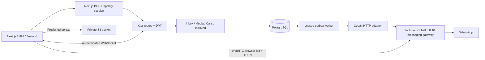

# Implementation and operating boundaries

## 1. Data model

`agents.subject` binds identity-provider subjects to active agents. `agent_queues` is the queue membership boundary for listing, claiming, reading, uploads, and mutations. This implementation is **single organization**; add organization keys and RLS before multitenant hosting.

`conversations` separates department (`queue_id`) from inbox state (`status`). A partial unique index allows one open conversation per customer JID. Tags use GIN; SLA deadlines derive from `waiting_since + queues.sla_seconds`. Replying clears waiting time; claiming does not incorrectly reset an SLA. A B-tree supports ordered queue claims, assigned views, and timelines.

`messages` uses a client UUID as an idempotency key, provider ID deduplication, constrained kinds/status, and `simple`-dictionary generated tsvectors with GIN. Search uses parameterized `websearch_to_tsquery`, bounded to the agent’s departments. `media_assets` holds object references rather than file bytes. `call_sessions` prevents overlapping active calls for an agent. `audit_events` records claims and routing mutations.

## 2. Backend and concurrency

Claim selects an eligible, unlocked row in a CTE using `FOR UPDATE OF c SKIP LOCKED`, then assigns it in the same statement and transaction. No candidate returns HTTP 409. Membership is part of the SQL predicate, not a frontend filter. Sending and routing require current ownership under a conversation-row lock. Concurrent duplicate sends serialize on that lock, compare their payload with the existing message, and return the original ID. An outbox record is committed in the same transaction as the message.

Outbox workers lease rows for 60 seconds, release the transaction before network I/O, use a 20-second gateway timeout, and retry up to eight times with exponential delay. Delivery is **at least once**, not exactly once: the gateway MUST durably deduplicate the client ID, including a crash after WhatsApp acceptance. Exhausted messages become failed. Operators must explicitly requeue a dead-letter record after fixing its cause; a UI retry reconciles the same ID and does not create a second WhatsApp message.

Inbound text uses a per-JID PostgreSQL advisory transaction lock, reuses/open-creates a conversation, and deduplicates by provider ID. Routing strategies match keyword, tag, or region, ordered by rule priority. Without a match the alphabetically first queue is the fallback; production should add an explicit default queue. Receipt progression cannot regress from read to delivered. Early receipts are stored separately and reconciled when the send acknowledgment commits.

Koin provides explicit dependencies. JDBC and S3 work run on `Dispatchers.IO`; the Cobalt adapter uses asynchronous Ktor HTTP calls. Typed domain errors map to HTTP 400/403/409/503. Cancellation propagates. Error responses do not expose SQL, tokens, or message content.

## 3. Realtime, mobile, media and calls

Realtime messages are invalidations rather than customer-content broadcasts. Every client re-fetch goes through authorization. A 30-second refresh repairs dropped invalidations, and reconnect has bounded exponential backoff. Signaling is scoped to the owning agent and JWT expiry closes the WebSocket. **The hub is process-local**: run one Ktor instance for prompt signaling, or replace it with Redis/NATS/pubsub plus durable signaling/replay before horizontal scale. Current list responses contain the most recent 100 conversations; timelines expose a backend `before` cursor but the current UI only displays the most recent 100 messages.

Uploads go directly to a private S3 bucket using a five-minute, content-type/length-signed PUT. The server checks ownership and validates object metadata before sending. Configure bucket CORS for only the app origin, `PUT/GET/HEAD`, and Content-Type; block public access and set lifecycle expiry for orphan uploads. Allowed files are JPEG/PNG/WebP/PDF/WebM/Ogg/MP4 audio, up to 16 MiB. Ktor never buffers the media upload. The included gateway ingests incoming images/documents/stickers/voice to private S3; the backend records customer-owned media references. A production quarantine/scanning stage is still required. Metadata verification is not malware scanning.

MediaRecorder uses 32-kbit/s Opus when supported and MP4 audio as a browser fallback. The recorder caps duration at two minutes and releases tracks/AudioContext on stop, cancel and unmount. Audio playback supports 1×/1.5×/2×. File previews and demo voice notes use temporary blob URLs in memory. Gateway normalization/transcoding may still be required to match WhatsApp’s accepted codecs.

WebRTC implements offer/answer/ICE exchange, queues candidates until a remote description exists, handles microphone/camera permissions, camera switching, muting, and track cleanup. TURN REST credentials last ten minutes. Incoming/connecting calls time out after 60 seconds; the gateway must enforce provider-side timeout and active-call heartbeats. Incoming calls on unassigned conversations currently return conflict; the gateway must route/claim or decline them. Audio output selection uses supported browser APIs and provides a device-controls fallback. The browser WebRTC leg **does not implement WhatsApp’s native media transport**. This is a separate integration, not an SDP forwarding trick.

The PWA includes a manifest, notification handling and safe-area layout. The service worker deliberately does not cache customer data. It contains a generic push handler, but push subscriptions, VAPID delivery, and background-call reliability on mobile are not implemented. Foreground calls use WebSockets. A production mobile PWA cannot promise native phone-style incoming-call delivery while suspended without verified platform support.

## 4. Production work still required

- Pair and verify the included Cobalt messaging gateway against a real account, exercise media codecs, and add automatic history replay for inbound failures before callback persistence. Session persistence, media ingest, voice normalization and durable send/callback ledgers are implemented. A native call-media gateway remains unimplemented. See BRIDGE.md.
- Add OIDC authorization-code/PKCE sign-in, token refresh/revocation, supervisor permissions and agent/department provisioning. HMAC JWT verification and queue authorization are implemented; the development issuer is not a production identity provider.
- Deploy HTTPS, private networking, managed secrets, S3 policy/quarantine/scanning, signed gateway event replay protection and operational rate limits.
- Add push subscription/sender service, call-history UI, swipe-to-resolve confirmation, timeline/inbox pagination UI, offline durable drafts, and inbox access audit as needed before the complete requested product launch.
- Add a shared event bus for multiple backend instances, active-call reaper/heartbeat, durable call signaling replay, and structured health/metrics/alerts.
- Run gateway/account end-to-end tests, authorization/revocation tests, codec/device tests on iOS/Android, and sustained-load tests. Define backup/restore, data retention/deletion, outbox dead-letter alerts and recovery.

The repository avoids representing these remaining items as working production features.
